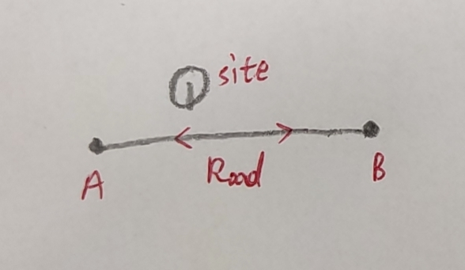
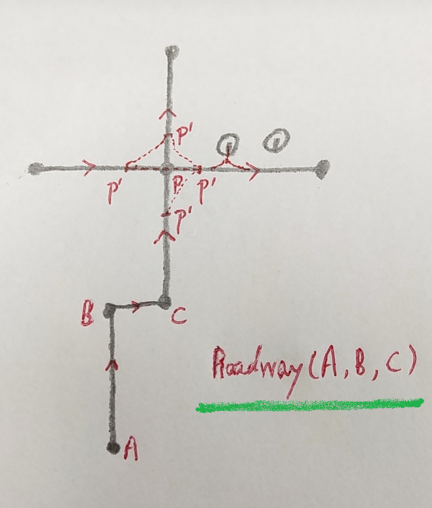

# 一种AGV调度系统的设计方法

## 目录

* [目标](#目标)
* [架构设计](#架构设计)
* [对时服务](#对时服务)
* [数据管理](#数据管理)
* [网络架构](#网络架构)
* [基础模型](#基础模型)
* [核心服务](#核心服务)
* [模拟器](#模拟器)
* [设计工具](#设计工具)
* [用户程序](#用户程序)
* [工具集](#工具集)

---

## 目标

开发一种通用的地图模型，统一的通信模型，硬件抽象化，通过调度算法完成AGV移动及动作任务。

---

## 架构设计

完整的调度系统包括 **调度算法**，**任务接口**，**模拟器**，**设计工具**，**用户程序**，**对时服务**，**工具集** 等

---

## 对时服务

系统内的时间同步非常重要，是分析数据流，业务流的基础。亚秒级的时间同步最简单的一种方式是NTP对时。

NTP授时精度与NTP服务器与用户间的网络状况有关：广域网授时精度通常能达50ms级，但有时超过500ms；局域网授时不存在路由器路径延迟问题，因而授时精度理论上可以提到亚毫秒级；但是**Windows内置NTP服务**在局域网内其最高授时精度也只能达10ms级。

Linux对时指令

```bash
apt-get install ntpdate
ntpdate cn.pool.ntp.org
# crontab 每小时执行一次
0 0 * * * * /sbin/ntpdate cn.pool.ntp.org
```

---

## 数据管理

### 配置文件

XML做程序配置文件

### 数据库

MySQL存储通信、任务、用户及统计信息等格式化数据

Redis做实时数据存储及推送

### 日志系统

按时间（天）分文件存储

---

## 网络架构

### 组网

一般采用WiFi组网，也有用移动网络、ZigBee等组网，很少用蓝牙

### 协议设计

调度算法与AGV间采用TCP通信，通信协议设计一般有二进制和文本两种。

* 二进制协议，数据量小性能高，但组帧解析复杂，不利于人为阅读分析
* 文本协议，一般采用json/xml格式，解析简单，扩展方便，可直接人工分析，但数据量较大

任务系统一般采用Http的形式对外开放

---

## 基础模型

### 地图

**地图**是整个调度算法的基础，其设计对路径规划和交通管理有决定性影响。包括 **节点**，**道路**，**站点**及其他配置信息等元素组成。

两个节点连成道路，站点分布在道路上或垂直于道路的两侧。道路分组抽象出高级的簇。

地图元素都包括丰富的属性。



### AGV

AGV是系统的执行单位，其模型接口必须符合调度协议。调度算法通过协议控制AGV移动并执行动作。

**PS**：AGV本身应有一套直接测试接口，包括传感器状态、总线、执行机构、行走等指令。

### 任务

任务来自上层应用，一般有WMS、ERP、模拟器等。包括来源、编号，移动目标，动作指令等。

---

## 核心服务

接受来自业务系统的任务请求，调度AGV，控制各功能设备，完成转移任务。

### 基础框架

定义系统基础模型，承载基础系统功能。

提供通信支持，监测并控制AGV运行。

对接上层应用，完成业务流。

以API形式暴露接口，提供第三方应用支持。

### 路径规划

常用的路径规划算法有Floyd、Dijkstra、A*、D*等。

通过一些配置或策略可以极大的优化运行速度，在多终端、动态场景中效果特别明显。

路径下发分为两种形式，一次性下发和分段下发。


### 交通管理

交通管理分为**主动式**和**被动式**两种策略。

主动式策略先确认可安全通行再下发路径，需分段路径支持。对调度效率有一定的影响，对规划设计较高。

被动式策略根据AGV反馈状态控制是否继续行驶。对网络实时性要求高。



### 任务调度

任务调度算法，是一种先反向排除，后正向排序的多层过滤过程。

---

## 模拟器

### AGV模拟器

模拟器是一套抽象化的操作规范。它模拟AGV的运动，动作，通信等功能。

### 任务模拟器

调用任务接口，记录任务生命周期。

---

## 设计工具

### 地图编辑器

可视化编辑地图元素，生成地图文件。

### 可视化仿真

**原理**：启动模拟器，核心服务，通过接口交互，驱动仿真程序。

---

## 用户程序

Web程序向用户提供友好的3D可视化界面，向用户展示系统运行状态和历史记录。

提供一定的测试功能。

良好的可扩展性，满足客户的多样化需求。

---

## 工具集

数据处理、分析等工具
